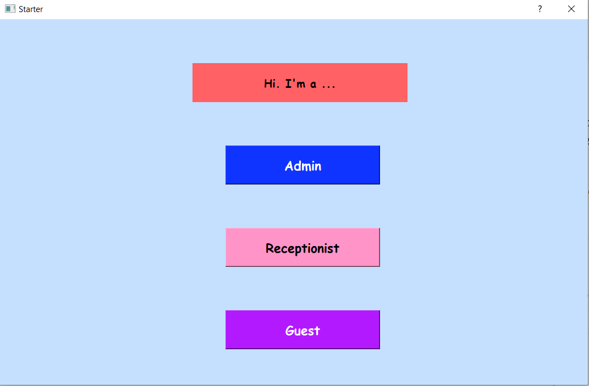
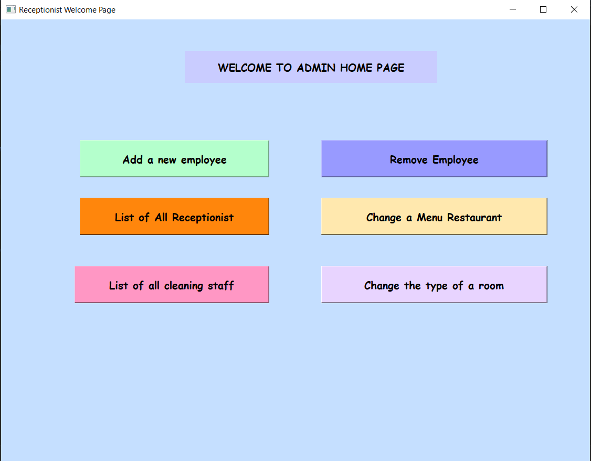
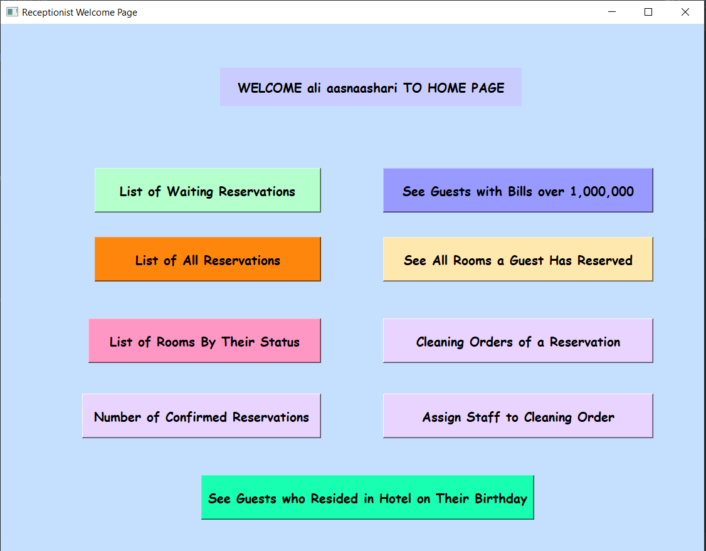
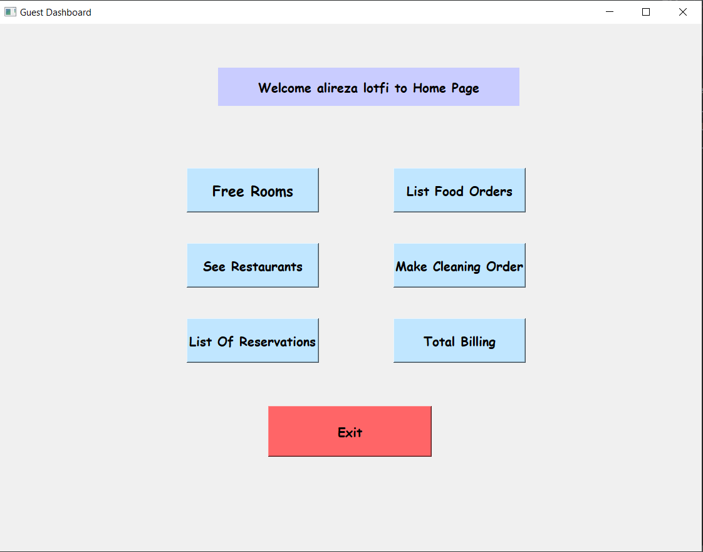

# Hotel-Management-System

### Starter

 
  

### Admin Overview

 
  

### Receptionist Overview

 
  

### Guest Overview

 
  

## Installation
- Clone and go to the project.
  - `git clone https://github.com/MiKoronjoo/CPU-scheduling-machine.git`
  - `cd Source Code`
  - `cd Start`
- Run thr program.
  - `python3 master_page.py`
  
